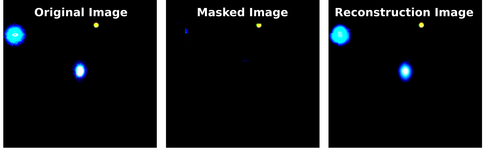
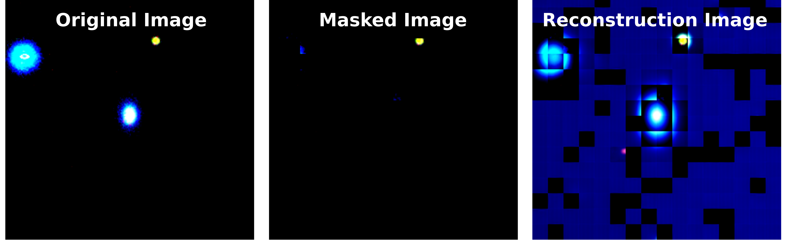

# MAE Self-Supervised Learning on Galaxy10-DECALS

This repository implements Masked Autoencoder (MAE) self-supervised learning on the Galaxy10-DECALS dataset using Vision Transformers. The project explores MAE pre-training on astronomical galaxy images and evaluates learned representations through comprehensive linear probing and fine-tuning experiments. Pre-trained encoder can be accessed at https://drive.google.com/file/d/1X9Lyk1Nqn5TSbjmrb3XOFZmFwPkBBjDB/view?usp=sharing. All experiments are run on Oscar.

## Results

### Comprehensive Evaluation Results

| Method | Accuracy | Gain over Random |
|--------|----------|------------------|
| **Zero-shot (Random Init)** | 10.99% | baseline |
| **Random Init - Linear Probe** | 25.54% | +14.55% |
| **SSL Pretrained - Linear Probe** | 66.23% | +40.69% |
| **Random Init - Fine-tune** | 64.21% | +38.67% |
| **SSL Pretrained - Fine-tune** | 77.51% | +66.52% |

### Key Findings
- **SSL Pretraining improves Linear Probing by: +40.69%** (2.59x better than random)
- **SSL Pretraining improves Fine-tuning by: +13.30%**
- **Best overall method**: SSL Pretrained Fine-tuning at **77.51%**
- **Optimal Mask Ratio**: 0.75 (tested 0.65-0.90 range)

## Reconstruction Example
- without pixel normalization loss

- using pixel normalization loss


## Environment Setup

### Installation

```bash
pip install -r requirements.txt
```

## Dataset

The Galaxy10-DECALS dataset will be automatically downloaded when running the experiments. It contains 17,736 galaxy images across 10 classes.

## Quick Start

1. **Pre-train MAE model**:
   ```bash
   sbatch run_ssl
   ```

2. **Run comprehensive evaluation**:
   ```bash
   sbatch run_linear_probe_array.sh
   ```

## Running Experiments

### 1. MAE Pre-training

```bash
# Run pre-training experiments
sbatch run_ssl

# Or run single experiment
python main.py \
    --use_wandb \
    --lr 3e-4 \
    --epochs 400 \
    --batch_size 512 \
    --mask_ratio 0.75 \
    --hidden_size 384 \
    --num_layers 12 \
    --decoder_hidden_size 256 \
    --decoder_num_layers 4
```

### 2. Linear Probing and Evaluation

```bash
# Run all 4 experiments in parallel (zero-shot, random/SSL × linear probe/fine-tuning)
sbatch run_linear_probe_array.sh

# Or run comprehensive evaluation directly
python linear_probe_checkpoints.py \
    --comprehensive_eval \
    --ssl_checkpoint ./outputs/mae_lr3e-4_decl4_mask0.75_normfalse_172129/encoder.pth \
    --probe_epochs 90 \
    --probe_lr 1e-3 \
    --finetune_epochs 90 \
    --finetune_lr 1e-3 \
    --batch_size 2048
```

### 3. Custom Checkpoint Evaluation

If you have your own pre-trained checkpoint:

```bash
python linear_probe_checkpoints.py \
    --comprehensive_eval \
    --ssl_checkpoint /path/to/your/encoder.pth \
    --probe_epochs 90 \
    --probe_lr 1e-3 \
    --finetune_epochs 90 \
    --finetune_lr 1e-3 \
    --batch_size 2048
```

## Key Files

- `main.py`: MAE pre-training implementation
- `linear_probe_checkpoints.py`: Comprehensive evaluation pipeline (4 experiments)
- `run_ssl`: SLURM script for pre-training experiments
- `run_linear_probe_array.sh`: SLURM array script for parallel evaluation (4 jobs)

## Architecture

- **Model**: Custom ViT with 384 hidden size, 12 layers, 6 attention heads
- **Pre-training**: MAE self-supervised learning (following original protocol)
- **Evaluation**: Linear probing and full fine-tuning with comprehensive baselines
- **Framework**: HuggingFace Transformers with PyTorch
- **Logging**: Weights & Biases integration for experiment tracking

## Hyperparameter Search Results

| Parameter | Tested Range | Best Value |
|-----------|--------------|------------|
| Learning Rate | 1e-4, 3e-4, 1e-3 | 3e-4 |
| Decoder Layers | 2, 4, 8 | 4 |
| Mask Ratio | 0.65-0.90 | 0.75 |
| Pixel Normalization | true, false | false |

## Ablation Studies

1. **Mask Ratio Analysis**: Comprehensive search from 0.65 to 0.90
2. **Pixel Normalization**: Tested Kaiming He's "pixels with normalization" approach
3. **Baseline Comparison**: Random ViT vs SSL pre-trained models across 4 evaluation settings
4. **Training Strategy**: Linear probing vs full fine-tuning comparison


## Citation

If you use this code, please cite the original MAE paper:

```bibtex
@article{he2022masked,
  title={Masked autoencoders are scalable vision learners},
  author={He, Kaiming and Chen, Xinlei and Xie, Saining and Li, Yanghao and Doll{\'a}r, Piotr and Girshick, Ross},
  journal={Proceedings of the IEEE/CVF Conference on Computer Vision and Pattern Recognition},
  year={2022}
}
```
